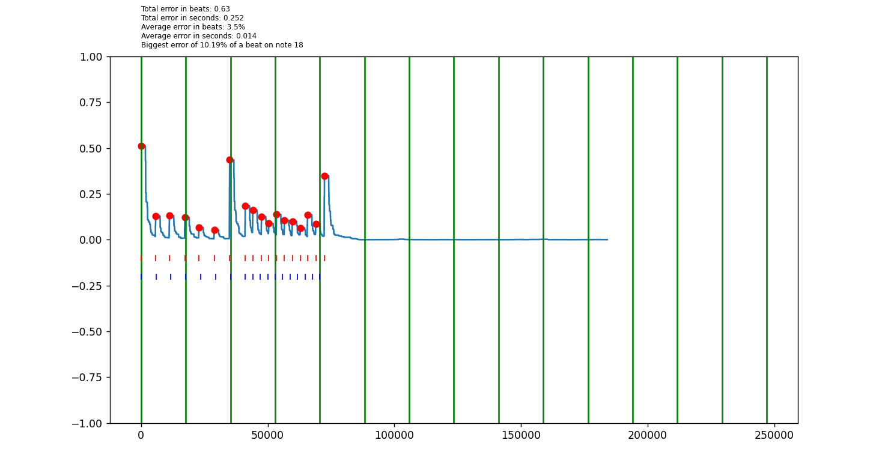

# drumline-analysis

### Intro

I played the marching snare drum for close to eight years, including marching with Matrix A in 2021. They went on to become an open-class group and I went on to quit the activity because of its opportunity cost. This is a script for analyzing a recording of marching snare music. It's only appropriate for music without flams or buzzes. Useful for detecting and quantifying:

* Rhythmic accuracy
* Volume consistency
* Diddle quality

Some suggested exercises include:

* 8s
* Accent tap
* Tap rolls
* Paradiddles
* Crecendos and decrecendos
* 16th note and triplet juxtaposition

You'll be surprised how poorly you actually play these. Get back to the basics. Not just saying that because this script can't handle flams or buzzes.

### Instructions

To use, locate the "audio.py" script and follow these steps:

1. Change INTENDED_BPM and INTENDED_RHYTHM according to comment.
2. Ensure MAKE_NEW_RECORDING is True and SECONDS is set to a number close to how long your recording will take.

The script will record your audio for SECONDS seconds, indicated by a terminal prompt. When it's over, a .wav file will be generated, placed in the main project directory, and analyzed. You'll recieve a friendly matplotlib chart with insights into your rhythmic accuracy and volume like the following, saved to the main directory as "output.png":

3. After generating the plot once, set OMIT_PEAKS to remove any false positives, or red circles on your plot where a note wasn't played (if you don't, the statistics will *not* be accurate). These should be indexed from 0, starting from the leftmost note detected.
4. Regenerate your plot with MAKE_NEW_RECORDING set to False. 

At this point you have your final analysis. As for the plot you get, the blue hashes indicate the mathematically perfect rhythm while the red indicate what you played. The green bars are downbeats. Statistics are present related to your error. An example recording and chart with omitted peaks is contained in this repo. Enjoy!
